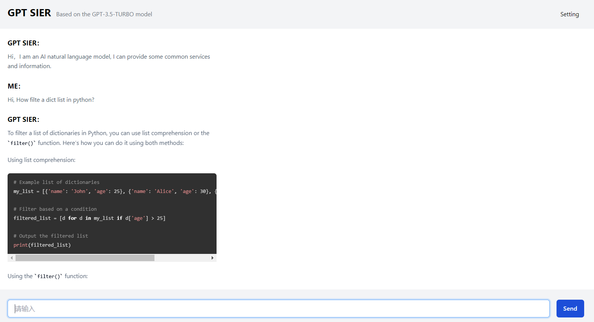
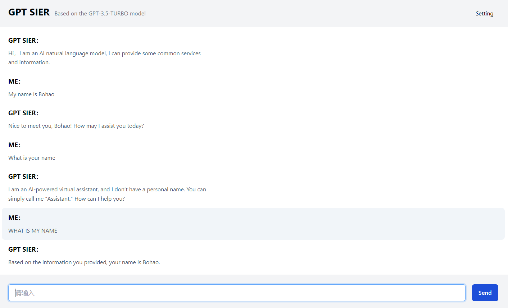

# GPT SIER
The back-end service is implemented based on Python, which is used to call OpenAI's `gpt-3.5-turbo` model API, which supports context memory function and can conduct multiple rounds of dialogue. The front-end interactive page is implemented based on Vue3 + vite + Typescript + Tailwind CSS. At the end of July, the `GPT-4` model can be supported, as well as speech recognition and image generation functions.

Referenced [CHATGPT-VUE](https://github.com/lianginx/chatgpt-vue)




## Back-end
```bash
pip3 install openai
python3 server.py
```

## Front-end
Before starting, make sure you have properly installed Node.js runtime environment, in this case `Nodejs 18.16.0`. If you do not have Node.js installed, please [click here to download it](https://nodejs.org/).

To use ChatGPT, you need to apply for an API Key first. Users who have registered but do not have an API Key can [generate it here](https://platform.openai.com/account/api-keys).

When ready, enter the project root directory and execute the following command to run the project:

```bash
npm i
npm run dev
```

运行成功时通常显示（请以具体为准）：

```bash
VITE v3.2.5  ready in 294 ms

➜  Local:   http://localhost:5173/
➜  Network: use --host to expose
```


## License

This project uses the [MIT](LICENSE) license
